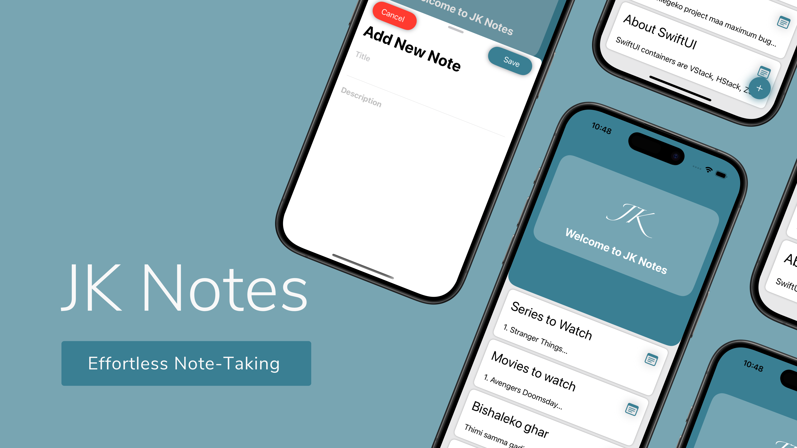
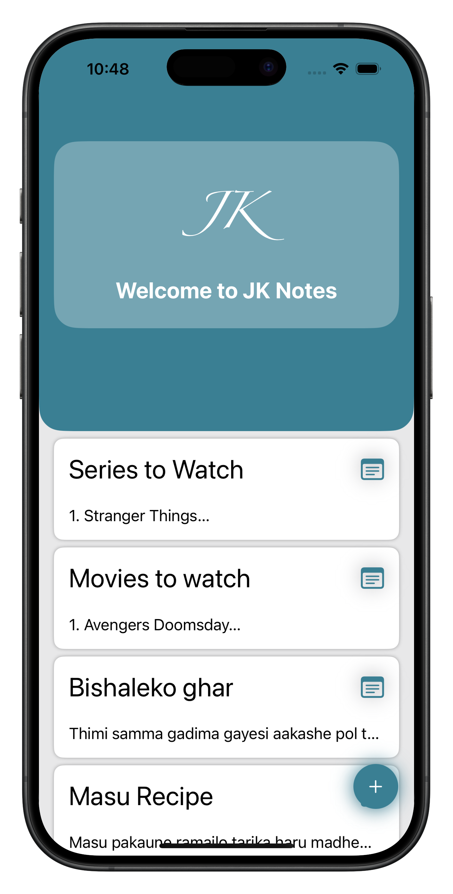
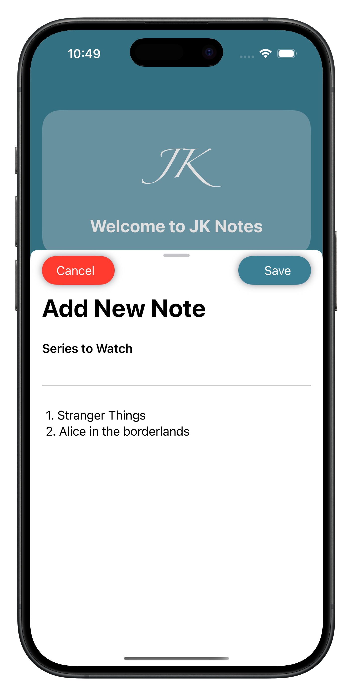
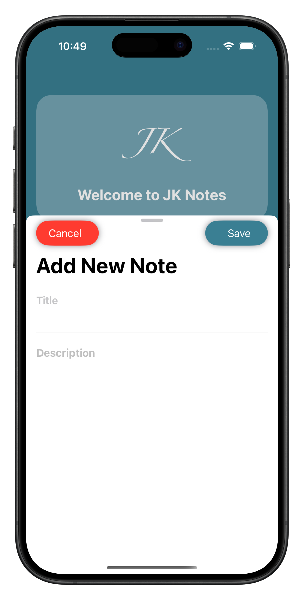

# Note-App-with-SwiftUI

An intuitive and minimalistic note-taking app built with **Swift** and **SwiftUI**. This app leverages **SwiftData** for data persistence and supports full CRUD (Create, Read, Update, Delete) functionality.

## Features

- **Swift & SwiftUI**: Fully designed using SwiftUI for a seamless and modern user experience.
- **SwiftData Integration**: Ensures efficient and persistent data storage.
- **CRUD Operations**: Users can create, read, update, and delete notes effortlessly.
- **Sheet for Adding & Updating Notes**: A smooth modal sheet interface for managing notes.
- **GeometryReader for CardView Height**: Dynamic UI layout adapting to different screen sizes.

## Screenshots


  


*Landing view*
  


*Update Note*
  


*Add new Note*
  


## Technologies Used

- Swift
- SwiftUI
- SwiftData

## Installation

1. Clone the repository:
   ```sh
   git clone https://github.com/janakkhadka/Note-App-with-SwiftUI
   ```
2. Open the project in Xcode.
3. Build and run on a simulator or a physical device.

## Contributing

Pull requests are welcome. For significant changes, please open an issue first to discuss what you’d like to change.


## Contact

For any inquiries, reach out via janakkhadka08@gmail.com.


## 🌟 Star the Project

If you find this project useful or interesting, please consider giving it a **star** on GitHub! Your support helps motivate further development and improvements.

